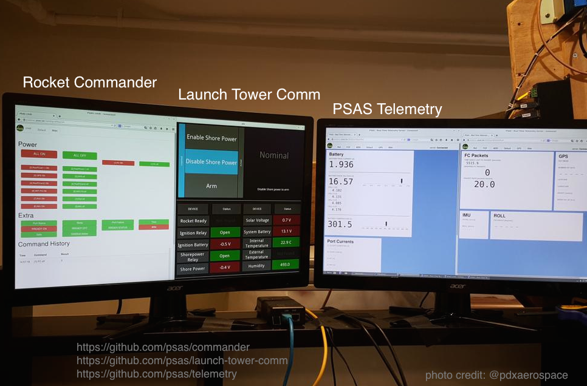

# Launch Tower Comm

Launch Tower Comm is the Portland State Aerospace Society's launch tower 
control.  

It is run by [Kivy](http://kivy.org), a multi-touch GUI framework, and 
[Phidgets](https://www.phidgets.com), "Unique and Easy to Use USB Interfaces."

[Portland State Aerospace Society](https://psas.pdx.edu)

---

## How to use it if you don't have a launch tower

If you have a remote Beagleboard or Raspberry Pi or similar connected to
Phidget Interface Kit boards, and want to control and observe them remotely,
this app could work for you.  

We use it to control relays connected to a Beagleboard on our launch
tower computer, and to display voltages and temperatures on the tower.

## Dependencies

The following list is not complete, in other words, each of the three items
may require dependencies not listed here.

* [Phidgets C library, Python module and Webservice](http://www.phidgets.com/docs/Software_Overview#Operating_System_Support)
* [Kivy](http://kivy.org/#download)
* At least one Phidgets Interfacekit connected throught the Phidgets webservice 

# Installation of Kivy and Twisted

## OS X 10.9 (Mavericks) 

* Valid as of Jan 25th 2014

Install Homebrew and get it setup properly, follow the suggestions it might
make.

    brew install python
    brew install virtualenvwrapper # might require additional setup
    brew install sdl sd_image sdl_mixer sdl_ttf portmidi
    brew install mercurial

    mkvirtualenv kivy
    pip install cython
    # pil might need a symlink to freetype, try it first
    pip install pil 
    pip install hg+http://bitbucket.org/pygame/pygame
    pip install kivy

At this point, grab a copy of the Kivy source that matches your installed
version. Copy the examples somewhere and try to run one of them. If things
don't work, get to googling.  If successful, you now need Twisted.

    pip install Twisted

# Preparing A Debian GNU/Linux "Unstable" System

The following procedure installs any software not available from
regular Debian sources to the user's home directory ($HOME/local/), as
opposed to regular system directories (/usr/lib, etc.).  System
directories should only be installed to by dpkg, using .deb packages.  

1. Install Debian's Kivy package (*python-kivy*), Python Imaging
   Library package (*python-pil*), and Twisted package
   (*python-twisted*)  with apt-get.  Any dependencies (including the
   Python runtime, PyGame, etc.) will be automagically resolved and
   installed:

        # apt-get install python-kivy python-pil python-twisted

2. Install Debian's libusb development support package (*libusb-dev*):

        # apt-get install libusb-dev

3. Download the Phidgets libraries and web service tarballs from
   http://www.phidgets.com/docs/OS_-_Linux

4. Configure and install the libraries and web service.

        $ tar xzf libphidget_2.1.8.20140319.tar.gz
        $ tar xzf phidgetwebservice_2.1.8.20140319.tar.gz
        $ cd libphidget-2.1.8.20140319
        $ ./configure --prefix=$HOME/local/
        [ ... time passes ... ]
        $ make install
        [ ... more time passes ... ]
        $ cd ../phidgetwebservice-2.1.8.20140319/
        $ export C_INCLUDE_PATH=$HOME/local/include
        $ export LIBRARY_PATH=$HOME/local/lib
        $ ./configure --prefix=$HOME/local/
        [ ... sit still ... ]
        $ make install
        [ ... hold fast ... ]
        $ export PATH=$HOME/local/bin:$PATH
        $ export LD_LIBRARY_PATH=$HOME/local/lib

5. Download the Phidgets Python library from
   http://www.phidgets.com/docs/Language_-_Python

6. Install the Phidgets Python library:

        $ unzip PhidgetsPython_2.1.8.20140428.zip
        $ cd PhidgetsPython
        $ python setup.py install --prefix=$HOME/local
        $ export PYTHONPATH=$HOME/local/lib/python2.7/site-packages

7. Add the environment variables defined above to your .bashrc:

        export C_INCLUDE_PATH=$HOME/local/include
        export LD_LIBRARY_PATH=$HOME/local/lib
        export LIBRARY_PATH=$HOME/local/lib
        export PATH=$HOME/local/bin:$PATH
        export PYTHONPATH=$HOME/local/lib/python2.7/site-packages
